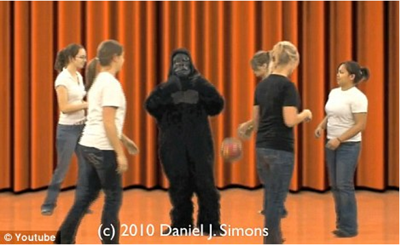
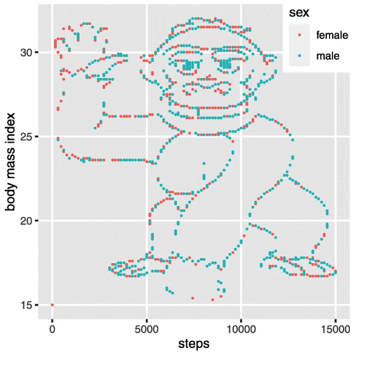
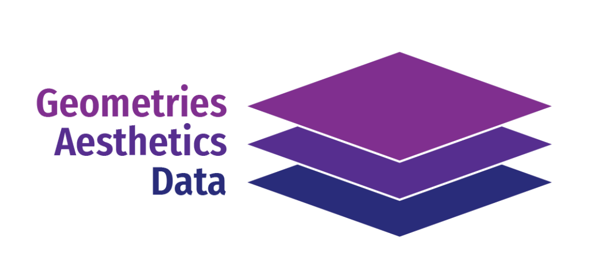

```{r setup, include=FALSE}
options(htmltools.dir.version = FALSE)
knitr::opts_chunk$set(
  #fig.width=6, 
  fig.retina=3,
  out.width = "100%",
  cache = FALSE,
  echo = TRUE,
  message = FALSE, 
  warning = FALSE,
  fig.show = TRUE,
  hiline = TRUE
)

library(tidyverse)
library(gapminder)
library(here)
library(gt)
library(hrbrthemes)
library(wesanderson)
library(viridis)
library(gapminder)
library(modelsummary)

library(xaringanthemer)


# This is the recommended set up for flipbooks
# you might think about setting cache to TRUE as you gain practice --- building flipbooks from scratch can be time consuming
knitr::opts_chunk$set(#fig.width = 6, 
                      comment = "")
library(flipbookr)


```

```{r xaringan-tile-view, echo=FALSE}

xaringanExtra::use_xaringan_extra(c("tile_view", "panelset"))

```

```{r xaringan-themer, include=FALSE, warning=FALSE}

style_mono_accent(base_color = "#00A1BA",
                  header_font_google = google_font("Josefin Sans"),
                  #text_font_google   = google_font("Montserrat", "300", "300i"),
                  code_font_google   = google_font("Fira Mono"))


```

class: inverse middle center

# Visualización con ggplot2
---

# Por qué visualizar?


Por qué molestarse? **Dadme razones.**

--

- Procesamiento cognitivo

- Reconocimiento de patrones

- Detección de problemas

- Comunicación de conclusiones


---

# Por qué visualizar?

.pull-left[

.panelset[
.panel[.panel-name[Ejemplo 1]

]

.panel[.panel-name[Gorila Real]

```{r, echo = FALSE}



```

]
.panel[.panel-name[Gorila Virtual]


```{r, echo = FALSE, fig.height= 4, out.width = "80%"}


```

]
]
]

.pull-right[
.panelset[
.panel[.panel-name[Ejemplo 2]

]
.panel[.panel-name[Tabla]

```{r, echo = FALSE}

t_estados <- tibble::tribble(
          ~estado, ~esperanza_vida, ~anyo,
      "Louisiana",            71.6, 1980L,
  "Massachusetts",            74.8, 1980L,
             "DC",            68.9, 1980L,
      "Louisiana",            74.1, 2000L,
  "Massachusetts",            78.2, 2000L,
             "DC",            72.1, 2000L,
      "Louisiana",            76.1, 2018L,
  "Massachusetts",            80.5, 2018L,
             "DC",            78.6, 2018L
  )

gt(t_estados)


```

]
.panel[.panel-name[Gráfica]


```{r, echo = FALSE, fig.height= 4, fig.width= 5, out.width = "90%"}

t_estados %>%
  ggplot(aes(x = anyo,
             y = esperanza_vida,
             color = estado,
             group = estado)) +
  geom_line() +
  geom_point() +
  theme_ipsum_pub() +
  labs("Esperanza de Vida por Estado") +
  scale_color_manual(values = wes_palette("Darjeeling1")) +
  theme(legend.position = "bottom")

```

]
]
]


---

## La gramática de los gráficos

.pull-left[

- La librería de gráficos más popular (y más mejor!) de R es `ggplot2`. Sigue principios basados en la **gramática de los gráficos**.

- La gramática de los gráficos es un principio que nos permite definir y organizar un plot según sus diferentes capas. 

- Esto permite **combinar piezas** para crear prácticamente todo tipo de gráficas.


]

.pull-right[
```{r, echo=FALSE, fig.cap="Una gráfica es como una cebolla."}
knitr::include_graphics("gog.png")
```
]
---

class: center middle

## Las capas de una gráfica: lo imprescindible

```{r, echo=FALSE}

```


---

## Las capas de una gráfica: lo imprescindible

- **Data**: vuestra base de datos o dataframe, siempre que sea posible en formato `tidy`.

- **Aesthetic mapping**: Los `aesthetic mappings` describen cómo las variables de los datos se asignan (mapean) a distintas propiedades visuales (la estética).

- **Geometries**: la geometría que queremos usar para mostrar nuestros datos.

---

## Ejemplo 

- **Data:** `gapminder`
- **Aesthetic mapping:** `mean_life_exp` al eje x, `continent` al eje y 
- **Geometries:** columna, o `geom_col()`

```{r, echo = FALSE, fig.width= 9, fig.height= 3.5}

gapminder %>%
  filter(year == 2002) %>%
  group_by(continent) %>%
  summarize(mean_life_exp = mean(lifeExp)) %>%
  ggplot(aes(y = continent,
             x = mean_life_exp)) +
  geom_col() +
  theme_minimal()


```
---

## Ejemplo 

- **Data:** ?
- **Aesthetic mapping:** ?
- **Geometries:** ?

```{r, echo = FALSE, fig.width= 9, fig.height= 3.5}

gapminder %>%
  filter(year == 2002) %>%
  group_by(continent) %>%
  summarize(mean_life_exp = mean(lifeExp)) %>%
  ggplot(aes(y = continent,
             x = mean_life_exp,
             color = continent)
             ) +
  geom_point(size = 3) +
  theme_minimal() +
  guides(color = FALSE)


```


---

## Ejemplo 

- **Data:** ?
- **Aesthetic mapping:** ?
- **Geometries:** ?

```{r, echo = FALSE, fig.width= 9, fig.height= 3.5}

gapminder %>%
  filter(year == 2002) %>%
  ggplot(aes(y = lifeExp,
             x = gdpPercap,
             color = continent,
             size = pop)
             ) +
  geom_point() +
  theme_minimal() 


```

---

.pull-left[

## Los mappings

- `x`
- `y`
- `color`
- `fill`
- `alpha`
- `size`

]

.pull-left[

## Los geoms

- `geom_point()`
- `geom_histogram()`
- `geom_line()`
- `geom_bar()`
- `geom_smooth()`

]

---

## Scatterplot con `geom_point()`

.pull-left[

- Un gráfico humilde pero resultón

```{r, eval = FALSE}
gap_82 <- gapminder %>% 
  filter(year == 1982)

ggplot(data = gap_82,
       mapping =  aes(x = gdpPercap, #<< 
                        y = lifeExp)) + #<< 
  geom_point() #<< 

```
]

.pull-right[
```{r, echo=FALSE, fig.height = 5, fig.width=6}
gap_82 <- gapminder %>% 
  filter(year == 1982)

gapminder %>%
  filter(year == 1982) %>%
  ggplot(aes(x = gdpPercap, y = lifeExp)) +
  geom_point()

```
]

---

## Scatterplot con `geom_point()`

.pull-left[

- Se pueden acumular geoms! Recordad, todo es una cebolla.

```{r, eval = FALSE}
gap_82 <- gapminder %>% 
  filter(year == 1982)

ggplot(data = gap_82,
       mapping =  aes(x = gdpPercap,  
                        y = lifeExp)) + 
  geom_point() + #<<
  geom_smooth() #<<

```
]

.pull-right[
```{r, echo=FALSE, fig.height = 5, fig.width=6}
gap_82 <- gapminder %>% 
  filter(year == 1982)

gapminder %>%
  filter(year == 1982) %>%
  ggplot(aes(x = gdpPercap, y = lifeExp)) +
  geom_point() +
  geom_smooth() #<<

```
]

---

## Barras con `geom_bar()` y `geom_col()`

.pull-left[

- Las barras son un poco especiales, porque se pueden usar para **contar observaciones** o para **mostrar otras variables.**

- Para lo primero, usaremos `geom_bar()` (ojo con los mappings!), para lo demás `geom_col()` suele ser más cómodo.

```{r, eval = FALSE}

ggplot(data = gap_82,
       mapping =  aes(x = gdpPercap,  
                        y = lifeExp)) + 
  geom_bar() #<<

```
]

.pull-right[
```{r, echo=FALSE, fig.height = 5, fig.width=6}

gapminder %>%
  filter(year == 1982) %>%
  ggplot(aes(x = continent)) +
  geom_bar()

```
]

---

## Histograma con `geom_histogram()`

.pull-left[

- Notáis algo similar?

```{r, eval = FALSE}

ggplot(data = gap_82,
       mapping =  aes(x = gdpPercap)) + #<< 
  geom_histogram() #<< 

```
]

.pull-right[
```{r, echo=FALSE, fig.height = 5, fig.width=6}

ggplot(data = gap_82,
       mapping =  aes(x = gdpPercap)) + #<< ) 
  geom_histogram() 

```
]


---
class: center middle

# Probando los mappings: breve demostración

---
class: inverse center middle

# themes y facets: dos elementos más

---

# `themes` and co.

.pull-left[
- Los `themes` se pueden usar para cambiar la apariencia o estilo del gráfico.

```{r, eval = FALSE}

install.packages("hrbrthemes")
library(hrbrthemes)

ggplot(data = gap_82,
       mapping =  aes(x = gdpPercap)) +  
  geom_histogram() +
  theme_ipsum() #<< 

```

]

.pull-right[
```{r, echo = FALSE, fig.height = 5, fig.width=6}

ggplot(data = gap_82,
       mapping =  aes(x = gdpPercap)) +  
  geom_histogram() +
  theme_ipsum()

```
]

---

# `themes` and co.

.pull-left[
- Los `facets` nos simplifican el proceso de visualizar diferencias entre categorías.

```{r, eval = FALSE}

ggplot(data = gap_82,
       mapping =  aes(x = gdpPercap)) +  
  geom_histogram() +
  theme_minimal() + #<< 
  facet_wrap(~continent) #<< 

```

]

.pull-right[
```{r, echo = FALSE, fig.height = 5, fig.width=7}

ggplot(data = gap_82,
       mapping =  aes(x = gdpPercap)) +  
  geom_histogram() +
  theme_minimal() +
  facet_wrap(~continent)

```
]
---

class: inverse center middle

## Anatomía de un ggplot

---

`r chunk_reveal("my_gap")`

```{r my_gap, include = FALSE}

gapminder %>%
  filter(year == 1982) %>%
  ggplot() +
  aes(x = gdpPercap) +
  aes(y = lifeExp) +
  geom_point() +
  aes(color = continent) +
  aes(size = pop) +
  theme_ipsum() +
  labs(title = "PIB y esperanza de vida en 1982",
       subtitle = "Datos del proyecto Gapminder, creado por Hans Rosling",
       x = "PIB per cápita",
       y = "Esperanza de vida",
       color = "Continente",
       size = "Población") 


```


---

class: inverse center middle

# Preguntas?


