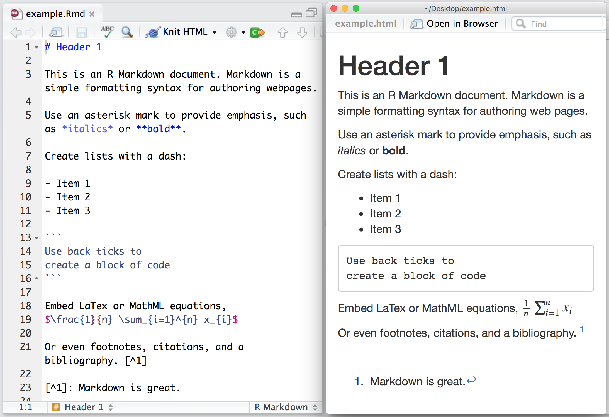
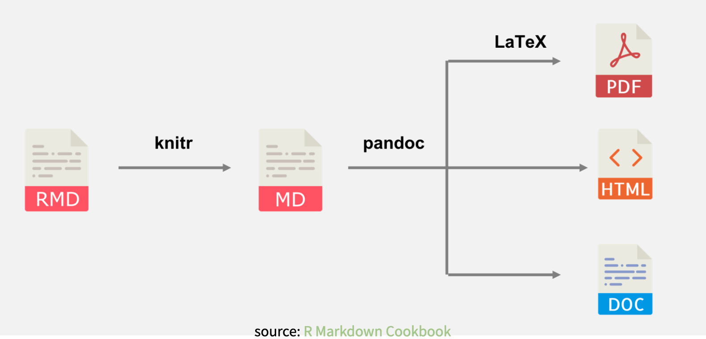

```{r setup, include=FALSE}
options(htmltools.dir.version = FALSE)
knitr::opts_chunk$set(
  #fig.width=6, 
  fig.retina=3,
  out.width = "100%",
  cache = FALSE,
  echo = TRUE,
  message = FALSE, 
  warning = FALSE,
  fig.show = TRUE,
  hiline = TRUE
)

library(tidyverse)
library(gapminder)
library(here)
library(gt)
library(hrbrthemes)
library(wesanderson)
library(viridis)
library(gapminder)
library(modelsummary)

library(xaringanthemer)


# This is the recommended set up for flipbooks
# you might think about setting cache to TRUE as you gain practice --- building flipbooks from scratch can be time consuming
knitr::opts_chunk$set(#fig.width = 6, 
                      comment = "")
library(flipbookr)


```

```{r xaringan-tile-view, echo=FALSE}

xaringanExtra::use_xaringan_extra(c("tile_view", "panelset"))

```

```{r xaringan-themer, include=FALSE, warning=FALSE}

style_mono_accent(base_color = "#00A1BA",
                  header_font_google = google_font("Josefin Sans"),
                  #text_font_google   = google_font("Montserrat", "300", "300i"),
                  code_font_google   = google_font("Fira Mono"))


```

class: inverse middle center

# Literate programming con Rmarkdown
---
class: inverse middle center

Antes de empezar:

```{r, eval = FALSE}
install.packages("rmarkdown")
install.packages("palmerpenguins")
```


---

# Es todo un follón

Qué os molesta del workflow de análisis actual? **Dadme razones.**

--

- Copiar y pegar (tablas, imágenes, regresiones, grâficas)

- Mezcla de software

- No saber de dónde salen las cosas

- Modificar todo a mano cuando hay algún cambio

---

## Literate programming

.pull-left[

- El **literate programming** es el principio de mezclar código con texto escrito para facilitar la comprensión al lector, y explicar e interpretar lo que estamos haciendo.

> En lugar de imaginar que nuestra tarea principal es instruir a una computadora sobre lo que debe hacer, concentrémonos en explicar a los seres humanos lo que queremos que haga una computadora.
- Donald Knuth


]

.pull-right[
```{r, echo=FALSE, fig.cap="Trabajar y juguetear."}

```
]
---
class: inverse center middle

## RMarkdown tiene dos piezas: `R` y `Markdown`

---

# Markdown

- Un lenguaje sencillo para darle un formato básico al texto y que siga siendo legible. 

- Es fácil de aprender y muy común.

### Reglas:

- Usad almohadillas para definir sessiones: `# Sección 1` y `## Sección 2`

- Para **negrita**, utilizad `**doble asterisco**`

- Para *cursiva*, utilizad `*un asterisco*`

- Para Latex, rodead cualquier expresión matemática con `$` o `$$` para doble línea

- Para listas, utilizad guiones y números

---

# Rmarkdown


```{r, echo=FALSE}

```

---

class: center middle

# RMarkdown: the basics

Crear documentos

Reglas básicas

Editor visual

---

class: center middle

# RMarkdown: cambiar de output y ajustes

Cambiar los ajustes de los chunks

Generar documentos en Word

Breve intro a otras posibilidades: `xaringan` y `flexdashboard`

---

class: center middle

# `distill`: un formato bonito para documentos y webs

---

class: inverse center middle

# Preguntas?


